# Kuroko 弹幕子系统架构

本文记录当前 Kuroko 弹幕子系统的实际架构、它和 NipaPlay DFM+ 弹幕系统的对应关系，以及后续应替换/保持的边界。核心结论是：Kuroko 也应该把自己视为一个 NipaPlay 弹幕系统的原生化承载者。弹幕系统的输入仍然是弹幕文件和用户配置，布局内核应尽量保持 DFM+ 的输入输出语义，最终输出随视频帧一起进入 Kuroko 原生 renderer。

## 当前目标

Kuroko 的弹幕不是外部 UI 层，也不是单独跑的显示系统。它是播放核心的一部分：播放器给出当前视频帧和同一时刻的 media time，弹幕布局只使用这个 media time 查询当前应显示的弹幕，renderer 在同一个 render tick 中合成视频、字幕和弹幕。

从抽象上看，目标链路是：

```text
Danmaku file / JSON / XML / user config
  -> DanmakuSession / track manager
  -> active DanmakuTimeline
  -> DFM+ layout core
  -> per-media-time positioned danmaku
  -> Kuroko render plan
  -> Metal / WGPU native danmaku pass
```

这条链路里，DFM+ 的职责是布局和过滤；Kuroko 的职责是输入会话、时钟、生命周期、C ABI、字体/字形资源和原生 GPU 合成。二者的边界不能混掉：Kuroko 不应该重新发明一套“像 DFM 的算法”，而应该让 DFM+ 输入输出语义在 Kuroko 内核里成立。

## NipaPlay 弹幕系统的抽象结构

NipaPlay 的弹幕系统本质上分成四层。

第一层是输入规范化。弹幕可能来自弹弹 play、本地 JSON、本地 B 站 XML、手动匹配的弹幕轨道或缓存；Flutter 侧把它们整理成统一的 map 列表。每条弹幕抽象上至少包含出现时间、文本、类型、颜色、自发弹幕标记等字段，用户设置则包含字号、显示区域、滚动时长、密度、最大行数、合并重复、屏蔽词、描边、阴影、字体等。

第二层是 DFM+ 准备阶段。NipaPlay 的 `DfmPlusLayoutBridge.configure` 会在弹幕列表、窗口尺寸、字号或配置变化时调用 Rust `dfm_plus_prepare_layout_full`。这个阶段把整条弹幕轨道和用户设置交给 DFM+，DFM+ 完成测量、过滤、重复合并、轨道分配和碰撞避让，输出一个 prepared layout。prepared layout 不代表当前帧；它代表“这条弹幕轨道在当前 viewport/config 下的稳定布局结果”。

第三层是逐帧查询。播放时只把当前播放时间交给 prepared layout 查询当前帧应该显示哪些弹幕。NipaPlay 在 Dart 侧做了同步计算，逻辑等价于 Rust 的 `build_dfm_plus_frame`：用时间二分找可见窗口，再根据 elapsed 计算滚动弹幕的 x，固定弹幕则使用准备阶段算好的居中 x 和 y。

第四层是呈现。NipaPlay 当前用自己的 Flutter/Texture 路径把 positioned danmaku 画出来；这部分不是 DFM+ 布局内核。Kuroko 要替换的是这一层的呈现方式：保留 DFM+ 的布局输入输出，把 positioned danmaku 转成 Kuroko 的 glyph atlas / quad instances，然后在 Metal/WGPU 的视频渲染管线里合成。

## NipaPlay DFM+ 内核的输入输出

NipaPlay DFM+ Rust API 的关键文件是 `/Users/sakiko/Desktop/NipaPlay-Reload/rust/src/api/dfm_plus.rs`。它暴露的抽象是 prepare + frame query。

prepare 输入是一批已规范化的弹幕 item，加上 viewport 和用户配置。item 的核心字段是：`time_seconds`、`text`、`type_code`、`color_argb`、`is_me`，以及用于碰撞一致性的 `paint_width` / `paint_height`。配置的核心字段是：`width`、`height`、`font_size`、`display_area`、`scroll_duration_seconds`、`allow_stacking`、`merge_danmaku`、`max_quantity`、`max_lines_per_type`、`track_gap_ratio`、`outline_width`、`block_words`。

prepare 输出是 prepared layout。它保存 viewport、滚动/固定弹幕时长、排序后的 prepared items、item_times 和轨道统计。prepared item 保存文本、时间、类型、颜色、是否自发、字号倍率、合并计数、y_position、宽度、scroll_speed、duration、是否滚动、固定弹幕 centered_x 等。这个输出是后续逐帧查询的状态来源。

frame query 输入只有 prepared layout handle 和 `current_time_seconds`。输出是当前帧的 positioned items：每个 item 只包含 `item_index`、`x`、`y`、`offstage_x`。文字、颜色、类型等样式不在 frame item 里重复携带，而是通过 `item_index` 回查 prepared item。

这个输入输出模型很重要：DFM+ 的完整能力来自 prepare 阶段统一处理整条轨道，而不是每帧临时决定一条弹幕的位置。Kuroko 后续要保持这个模型，只是把 handle store 改成 Kuroko 内部对象生命周期，把输出从 Dart positioned item 改成 Kuroko render plan。

## Kuroko 当前弹幕链路

Kuroko 当前已经有一条原生弹幕链路，主要在这些文件里：

- `crates/kuroko/src/danmaku.rs`：公开数据模型、parser、timeline、DFM adapter、frame layout、render plan、text rasterizer、glyph atlas。
- `crates/kuroko/src/danmaku/dfm.rs`：Kuroko 对 NipaPlay DFM+ prepare/frame-query 合约的 adapter。
- `crates/kuroko/src/danmaku/dfm_core/*`：从 NipaPlay DFM+ 迁入的 model、retainer、filters、measure、factory、timer、types。
- `crates/kuroko/src/presenter.rs`：把播放器 media time、generation、viewport 和弹幕 engine 接起来。
- `crates/kuroko/src/core.rs`：`RenderFrameContext` 把视频帧、字幕 overlay、弹幕 render plan 收敛成同一次 renderer 调用的输入。
- `crates/kuroko/src/renderer/metal/*` 和 `crates/kuroko/src/renderer/wgpu.rs`：执行原生弹幕 pass。
- `crates/kuroko_capi/include/kuroko.h` / `crates/kuroko_capi/src/lib.rs`：C ABI 暴露加载弹幕、清空、启用、配置和屏蔽词接口。
- `packages/kuroko_flutter/lib/src/kuroko_player.dart` 和 `packages/kuroko_flutter/macos/Classes/KurokoFlutterPlugin.swift`：Flutter wrapper 只调用 Kuroko C API。

当前实际数据流如下：

```mermaid
flowchart LR
  A["JSON / JSONL / Bilibili XML"] --> B["DanmakuTimeline per track"]
  B --> C["DanmakuSession tracks + offsets + enable state"]
  C --> D["Active DanmakuTimeline"]
  D --> E["DfmLayoutEngine"]
  E --> F["dfm.rs adapter"]
  F --> G["dfm_core retainer + filters"]
  G --> H["DfmPreparedLayout"]
  H --> I["DanmakuFrameLayout(media_time, generation)"]
  I --> J["DanmakuRenderPlan glyph atlas + instances"]
  J --> K["RenderFrameContext"]
  K --> L["Metal / WGPU video + subtitle + danmaku composition"]
```



这里 `dfm_core` 已经不是从零写的 Kuroko 算法，而是带 MIT attribution 的 NipaPlay DFM+ core 迁入版本。当前仍需要注意的是：`DanmakuSession` 是 Kuroko 的输入会话层，它负责多弹幕轨、按轨启用、按轨偏移、全局偏移和旧单轨 API 的兼容；`dfm.rs` 是 Kuroko adapter，它把 active timeline 和 `DanmakuLayoutConfig` 映射成 DFM+ prepare request，再把 DFM+ prepared/frame output 映射回 Kuroko 的 `DanmakuFrameLayout`。

## 当前 DFM+ 替换边界

应该替换成“尽量原封不动 DFM+ 内核”的部分，是 `crates/kuroko/src/danmaku/dfm.rs` 加 `crates/kuroko/src/danmaku/dfm_core/*` 这一段计算层。

这一段的输入应保持 NipaPlay DFM+ 的抽象：规范化弹幕 item、viewport、字体测量结果、用户配置。Kuroko 可以用自己的 Rust 类型承载这些字段，但字段语义要对齐 NipaPlay：时间、文本、type_code、颜色、is_me、paint_width/paint_height、display_area、scroll_duration、allow_stacking、merge、max_quantity、max_lines、track_gap、outline、block_words 等都应进入 DFM+ prepare。

在 DFM+ 之前，Kuroko 现在多了一层 `DanmakuSession`。它不参与布局算法，只负责把播放器/Flutter 传入的弹幕输入面整理成 DFM+ 能消费的一条 active timeline：多个弹幕轨可以同时启用，按轨 offset 和全局 offset 会在 active timeline 构建时应用，源 item id 会加上 track id 前缀以避免多轨合并后的 id 冲突。seek 不应该因为 generation 改变而重新 prepare；prepare 的失效条件应是 timeline/session 内容、viewport 或 config 变化，generation 只盖在当前帧输出上用于 renderer gate。

这一段的输出也应保持 NipaPlay DFM+ 的抽象：prepared layout 保存稳定布局结果；frame query 只根据 media time 输出当前 visible items 的 index 和位置。Kuroko 之后再把 item_index 对应的文本、颜色、字号、描边等样式转换成 `DanmakuFrameLayout` 和 `DanmakuRenderPlan`。

也就是说，Kuroko 允许改变的是外壳和最终绘制方式，不允许改变 DFM+ 内核的行为语义。C ABI 暴露给播放器/Flutter 的也应该覆盖 NipaPlay 弹幕系统的输入面：弹幕文件、弹幕 JSON/JSONL/XML、显示区域、字号、滚动时长、密度、最大行数、重复合并、屏蔽词、描边/阴影、启用状态、弹幕轨切换等。

## Kuroko 当前公开 API

Rust presenter 当前已经支持弹幕 session 输入面：加载/替换默认弹幕、追加多条弹幕轨、删除弹幕轨、按轨启用/禁用、按轨 offset、全局 offset、清空、启用和配置弹幕。旧的 `load_danmaku_file` / `load_danmaku_json` 仍然保留，它们语义是“替换默认弹幕轨”，用于兼容早期单轨调用。

C ABI 当前有这些入口：

```c
KurokoStatus kuroko_presenter_load_danmaku_file(KurokoPresenterHandle *handle, const char *uri);
KurokoStatus kuroko_presenter_load_danmaku_json(KurokoPresenterHandle *handle, const char *json);
KurokoStatus kuroko_presenter_add_danmaku_track_file(KurokoPresenterHandle *handle, const char *uri, const char *name, int64_t offset_micros, uint64_t *out_track_id);
KurokoStatus kuroko_presenter_add_danmaku_track_json(KurokoPresenterHandle *handle, const char *json, const char *name, int64_t offset_micros, uint64_t *out_track_id);
KurokoStatus kuroko_presenter_remove_danmaku_track(KurokoPresenterHandle *handle, uint64_t track_id);
KurokoStatus kuroko_presenter_set_danmaku_track_enabled(KurokoPresenterHandle *handle, uint64_t track_id, bool enabled);
KurokoStatus kuroko_presenter_set_danmaku_track_offset(KurokoPresenterHandle *handle, uint64_t track_id, int64_t offset_micros);
KurokoStatus kuroko_presenter_set_danmaku_global_offset(KurokoPresenterHandle *handle, int64_t offset_micros);
KurokoStatus kuroko_presenter_danmaku_tracks(KurokoPresenterHandle *handle, KurokoDanmakuTrackInfo *out_tracks, uintptr_t capacity, uintptr_t *out_len);
KurokoStatus kuroko_presenter_clear_danmaku(KurokoPresenterHandle *handle);
KurokoStatus kuroko_presenter_set_danmaku_enabled(KurokoPresenterHandle *handle, bool enabled);
KurokoStatus kuroko_presenter_set_danmaku_config(KurokoPresenterHandle *handle, KurokoDanmakuConfig config);
KurokoStatus kuroko_presenter_set_danmaku_font(KurokoPresenterHandle *handle, const char *family, const char *file_path);
KurokoStatus kuroko_presenter_set_danmaku_block_words_json(KurokoPresenterHandle *handle, const char *json);
```

`KurokoDanmakuConfig` 当前包含 enabled、font_size、opacity、display_area、scroll_duration_seconds、scroll_speed_factor、track_gap_ratio、outline_width、shadow_offset、shadow_style、merge_duplicates、allow_stacking、allow_scroll_overwrite、max_quantity、max_lines_per_mode、block_top、block_bottom、block_scroll。字符串型字体输入通过独立 `kuroko_presenter_set_danmaku_font` 传入，避免把临时字符串指针塞进 config struct。

Flutter wrapper 已经对应暴露 `addDanmakuTrackFile`、`addDanmakuTrackJson`、`removeDanmakuTrack`、`setDanmakuTrackEnabled`、`setDanmakuTrackOffset`、`setDanmakuGlobalOffset`、`danmakuTracks`，以及旧的 `loadDanmakuFile` / `loadDanmakuJson` / `clearDanmaku` / `setDanmakuConfig`。`setDanmakuConfig` 现在也能传 `customFontFamily`、`customFontFilePath` 和 DFM+ texture path 语义的 `shadowStyle`。也就是说，播放器侧现在可以按 NipaPlay 式“弹幕文件 + 用户配置 + 轨道控制”把输入推给 Kuroko，输出则继续跟随视频帧进入原生视图。

这已经补上了最关键的弹幕轨输入处理层和 DFM+ 字体/阴影输入。剩余需要继续对齐的是：远端弹幕源/缓存源的稳定 C ABI、更加结构化的屏蔽规则输入、配置持久化边界、NipaPlay 多内核选择抽象，以及 DFM+ adapter 中少数仍未完全透传的行为开关。

## 时间同步契约

弹幕时间同步由 Kuroko 播放核心负责，不由弹幕系统自己跑计时器。

`PlayerVideoFrame` 带有 `pts`、`media_time` 和 `generation`。presenter 在 `pump_video` 上传视频帧后，用 `frame.pts.unwrap_or(frame.media_time)` 作为当前弹幕查询时间。之后 `update_overlay` 用同一个 pts 生成字幕 overlay 和 danmaku render plan。最终 renderer 收到 `RenderFrameContext { media_time, generation, overlay, danmaku }`。

renderer 会 gate 掉不匹配的弹幕 plan。Metal 和 WGPU 都要求 plan 的 `generation` 等于 context generation，plan 的 `media_time` 等于 context media_time，并且 viewport 与当前输出尺寸一致。这样 seek、stop、close、弹幕轨切换或配置变化后，旧 generation 的弹幕 plan 不会继续进入渲染。

这个契约的含义是：弹幕位置不是“暂停时不动”这么简单，而是任何时刻都由视频 media timeline 决定。播放位置连续推进时，滚动弹幕随 media time 流式变化；pause 时 media time 不变，所以弹幕位置不变；seek 后 media time 跳到新位置，prepared layout 根据新时间直接查询对应弹幕，旧 plan 因 generation 不匹配被丢弃。

## 字体、测量和 glyph atlas

DFM+ 的碰撞结果依赖文本宽高。如果测量和实际绘制使用不同字体指标，轨道分配就会和最终画面不一致。因此 Kuroko 当前把 `DanmakuTextRasterizer` 放在 layout engine 内部：prepare 阶段会用同一套字体测量文本，render plan 阶段也用同一套 glyph rasterization / atlas 数据。

字号语义现在分成两层。弹幕源文件里的 `size` / XML 第三段仍按 B 站默认 `25` 作为相对基准；播放器和 Flutter wrapper 传入的 `KurokoDanmakuConfig.font_size` 则按 NipaPlay/Flutter 逻辑字号解释，桌面默认是 `30`。Kuroko 默认嵌入并优先使用 NipaPlay 的 `Droid Sans Fallback` 弹幕字体，然后只按 surface backing scale 把逻辑字号转换到 glyph atlas 的物理像素。调用方不需要、也不应该再额外乘任何 renderer 补偿比例。

Kuroko 的 render plan 不把整张弹幕文本当一张位图。它把每个字形缓存、打包进持久 glyph atlas，然后输出一批 `DanmakuGlyphInstance`。每个 instance 包含屏幕 rect、atlas tex_rect、正文颜色、描边颜色、阴影颜色和偏移。Metal/WGPU 只需要绑定 atlas 纹理并画 alpha mask quad。

当前 atlas 有 fill alpha 和 outline alpha 两份 mask，用于先画阴影/描边，再画正文。atlas 带 version，renderer 以 version/尺寸/stride 判断是否复用 GPU 纹理，避免每帧无意义重传整张 atlas。

## Renderer 合成位置

弹幕 pass 的位置在视频帧上传之后、present 之前。renderer 的输入不是外部窗口指针，也不是弹幕自己的 render loop，而是 `RenderFrameContext` 内的 `DanmakuRenderPlan`。

Metal 侧在 `render_video_frame_inner` 里先完成视频纹理绘制，再绘制字幕 overlay，再绘制 danmaku glyph instances。WGPU 侧也把 danmaku draw 合入当前视频 draw 流程，并用同样的 plan generation/media_time gate。弹幕统计通过 renderer stats 和 presenter stats 记录 `danmaku_passes`、`danmaku_items`、`danmaku_frames`。

## 当前和 NipaPlay 的差异

当前 Kuroko 已经保留了 DFM+ 的关键优点：prepare/frame-query 分离、时间窗口二分查询、track retainer、滚动碰撞避让、top/bottom 固定弹幕轨道、显示区域、track gap、密度控制、最大行数、重复合并、屏蔽词和 regex block 的基本结构。现在也补上了弹幕 session 层，可以把多条弹幕轨、按轨 offset、全局 offset、轨道开关统一整理成 active timeline 后再交给 DFM+。

但它还不是“完整原封不动的 NipaPlay 弹幕系统”。主要差异有：

- NipaPlay DFM+ API 使用 `DfmPlusPreparedLayout.handle` 和 `DfmPlusFrameRequest.layout_handle`；Kuroko 当前用内部 `DfmPreparedLayout` 对象，不需要全局 handle store。这是生命周期外壳差异，不应影响行为。
- NipaPlay prepared/frame 输出里 `frame item -> item_index -> prepared item` 的关系非常清晰；Kuroko 当前会进一步映射成 `DanmakuPlacedItem`，并提前携带文本/样式。这个可以工作，但必须继续保证 item_index/source id 语义不丢，方便行为对齐和测试对照。
- NipaPlay 的完整设置面来自 Flutter state，包括弹幕轨道、弹幕偏移、自定义字体、显示设置、屏蔽配置等；Kuroko C ABI 现在已经覆盖弹幕轨、偏移控制、自定义字体路径/family 和 DFM+ shadowStyle，但远端/缓存源、结构化屏蔽规则和配置持久化还需要继续补齐。
- Kuroko 的 renderer 输出已经原生化，这是预期差异；不应再用 NipaPlay 的最终呈现形态作为 Kuroko 的实现目标。
- 当前 `dfm_core` 已迁入，但 adapter 里仍有 Kuroko 自己的补充映射和配置解释。后续要以 NipaPlay DFM+ API 为基准逐项核对，而不是继续手写“风格类似”的行为。

## 后续实现原则

后续要做的是让 Kuroko 的计算层更像 NipaPlay DFM+，让 Kuroko 的渲染层更像 Kuroko 自己。

计算层应该保留 NipaPlay 的输入、输出和内核行为。可以删掉 NipaPlay 的 FRB 生成层、全局 handle store、Flutter widget 依赖，但不要删掉 DFM+ 需要的配置字段和中间状态。Kuroko adapter 应该只做类型转换、生命周期管理和 renderer-facing projection。

API 层应该把 NipaPlay 弹幕系统的输入面暴露给播放器和 Flutter wrapper。Flutter wrapper 只负责把用户设置、弹幕文件和轨道选择传给 Kuroko，不自己布局和绘制弹幕。

渲染层应该继续保持 Kuroko 原生。DFM+ 输出的是“当前 media time 下每条弹幕在哪里、是什么样式”，不是 GPU 纹理或 Flutter 资源。Kuroko renderer 根据这个输出生成/复用 glyph atlas、quad instances，并在 Metal/WGPU 中和视频同帧合成。

同步层必须保持现在的 generation + media_time 契约。seek、stop、close、track switch、config change 都使旧计划失效；每帧查询只看视频 timeline；弹幕不拥有独立 wall-clock timer。这个契约是解决“视频跳了但弹幕没跳”的根本。
